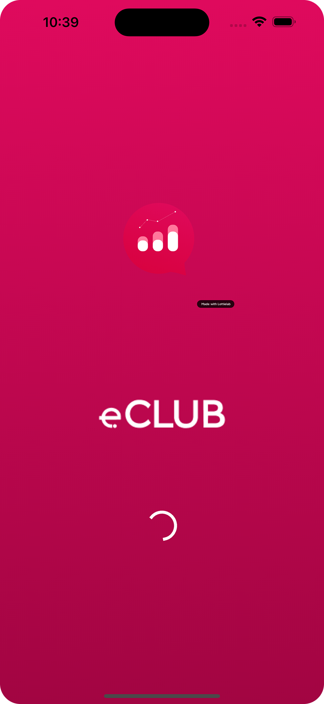
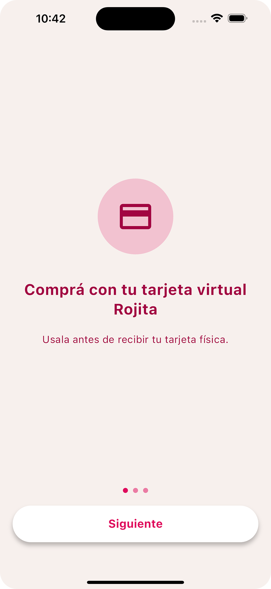
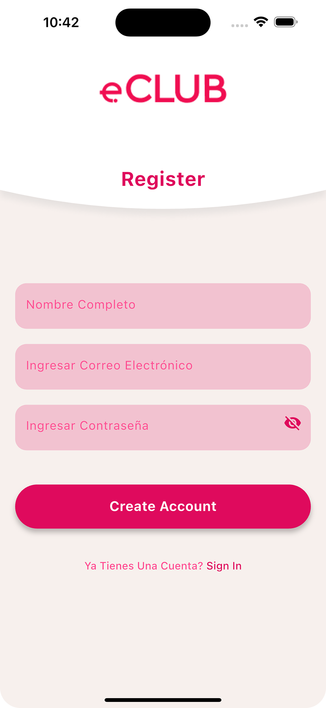
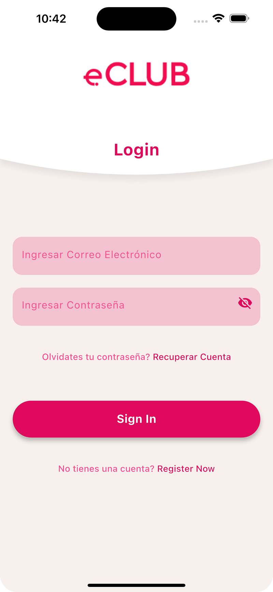
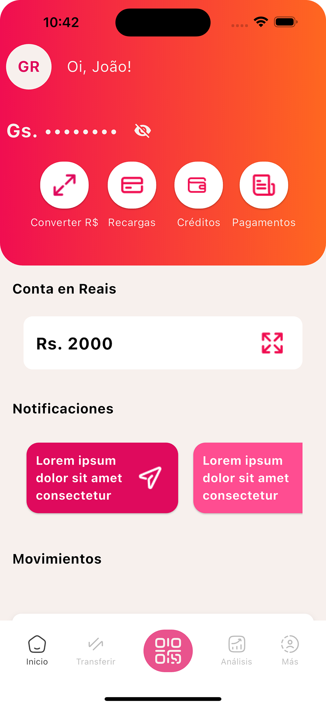
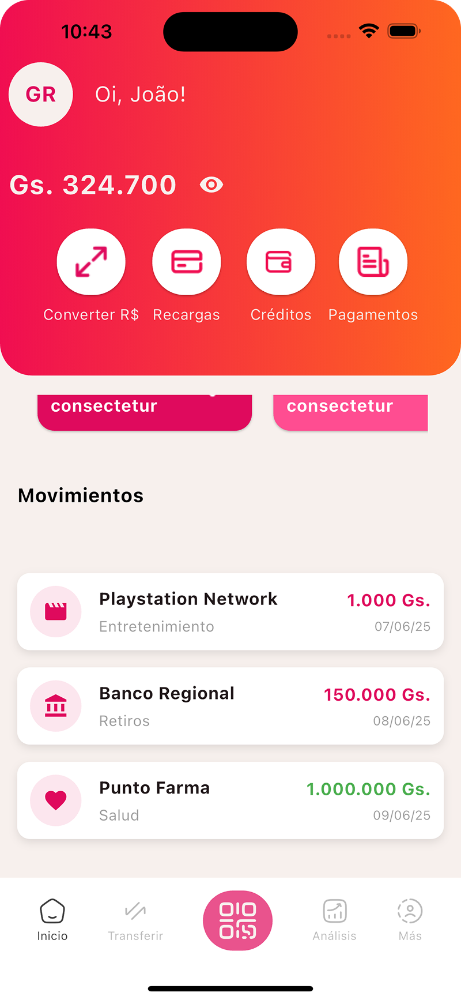
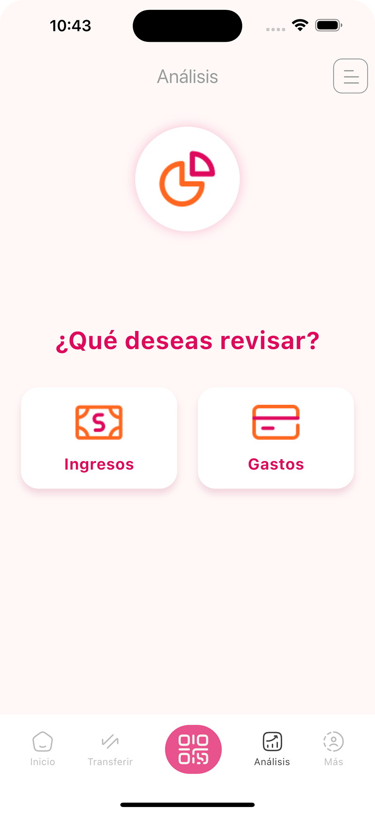
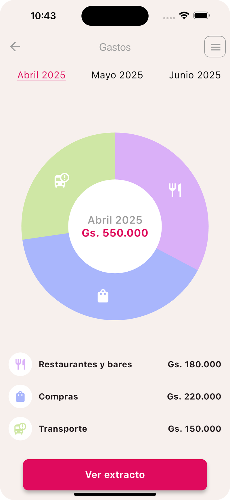
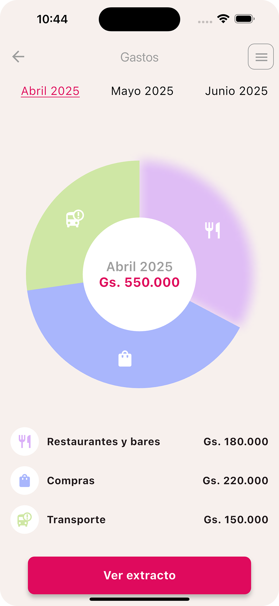
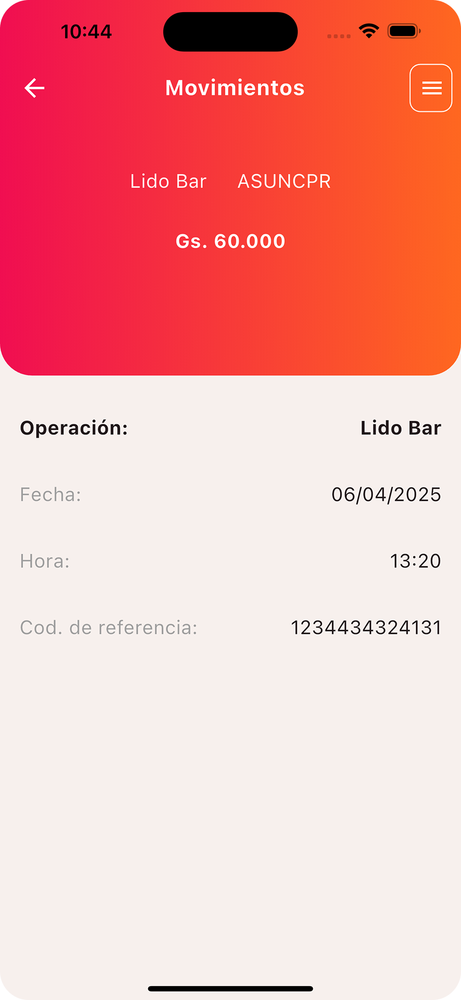

# 📱 E-Club - Gestión de Gastos Personales

Aplicación móvil desarrollada con **Flutter** como parte de una evaluación técnica. La app permite a los usuarios visualizar y gestionar sus gastos mensuales con una interfaz amigable y dinámica.

> **Nota:** Las imágenes, íconos y logotipos utilizados en esta aplicación fueron usados únicamente con fines educativos y de evaluación. No se reclama ningún tipo de derecho sobre los mismos.


> ## 📱 Capturas de Pantalla

<div align="center">
  
  
  
  
  <br>
  
  
  
  
  <br>
  
  
  
</div>

## 🚀 Cómo Generar el APK

Sigue estos pasos para generar el archivo APK de la aplicación:

### Requisitos Previos
- Flutter SDK instalado (versión 3.0 o superior)
- Entorno de desarrollo configurado (Android Studio recomendado)
- Dispositivo Android o emulador para pruebas

### Pasos para Generar APK

1. **Clonar el repositorio**:
   ```bash
   git clone https://github.com/tobias-tj/eClubApp.git
   cd e-club

2. ** Instalar dependencias:
      ```bash
       flutter pub get

4. **Para generar un APK de producción sin firma personalizada (modo release sin keystore), podés utilizar el siguiente comando:
    ```bash
    flutter build apk --release

### Ubicacion del apk:
build/app/outputs/flutter-apk/app-release.apk
Podés instalar ese APK directamente en un dispositivo Android para pruebas.
